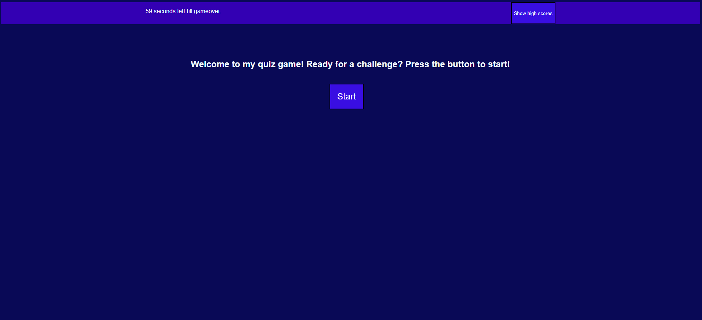

## Description
Welcome to my time limited quiz game! I made this quiz with the goal of making a functional game on a webpage and learned many things. The main thing is using local storage to store high scores at the end of the game and at the beggining if you click the view high scores button. Also learned very invaluable javascript lessons including button listeners and timer functions to time limit the game to only 60 seconds and adding 5 seconds when you input a right answer and taking 15 when you get a wrong one. The quiz is pretty simple its just a display of my newlearned knowledge of javascript! Hope you enjoy

## Screenshot

## Usage
Just click on the link and take a look! https://rockoban420.github.io/portfolio_lau/
